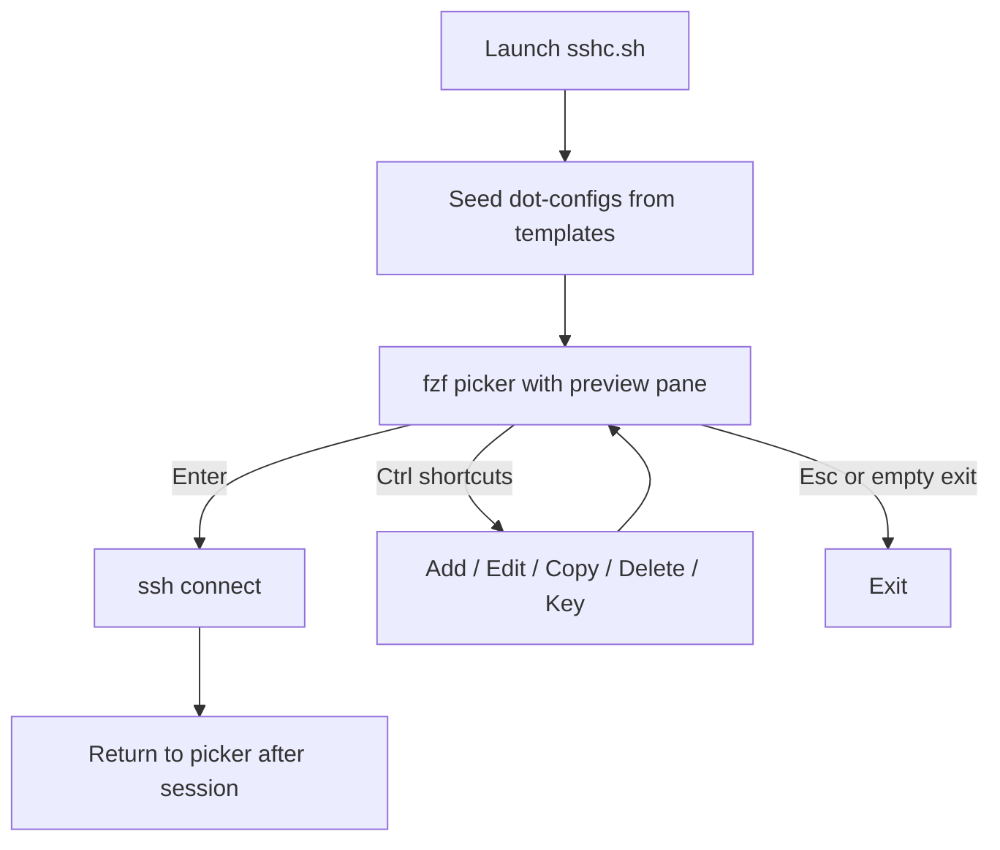

# sshc

Interactive SSH connection picker built on [fzf](https://github.com/junegunn/fzf). Manage a personal connection list and connect via `ssh` with optional tags, post-login commands, and encrypted passwords.

## Overview

`sshc` presents a searchable fzf list of SSH connections by **name**. All data lives in `~/.sshc/` — connections, encryption key, and configuration files. Bundled `*.template` files in the repository directory are defaults only; editable settings live in dot-prefixed files under `~/.sshc/`.

On each launch the script:

1. Ensures `~/.sshc/` exists and seeds missing dot-config files (`.sshc.*`) from bundled `*.template` files next to `sshc.sh`.
2. Opens the fzf picker with a live preview pane that probes reachability and auth state.
3. Returns to the picker after an SSH session ends (unless you exit with Esc).



**List display:**

- Entries are sorted by name (case-insensitive).
- **Cyan suffix** — user-defined tags from `tags_string`.

The fzf list shows the **name** for each entry. The preview pane shows the resolved **connection target** (`user@host`, with `$USER` when `user` is empty).

After most actions the cursor is restored on the same entry.

## Installation

### Requirements

Only [`sshc.sh`](sshc.sh) needs to be installed (or symlinked into `$PATH`). On first run the script creates `~/.sshc/` and seeds dot-config files from bundled `*.template` files if needed.

**Required dependencies:**

| Dependency | Purpose                                          |
| ---------- | ------------------------------------------------ |
| `bash`     | Script runtime                                   |
| `fzf`      | Interactive picker (checked at startup)          |
| `jq`       | Read and write connection JSON files             |
| `ssh`      | Connections, key-auth probe, `ssh-copy-id`       |
| `openssl`  | Password encryption (`~/.sshc/key`, AES-256-CBC) |

**Recommended / feature-specific:**

| Dependency            | When needed                                                             |
| --------------------- | ----------------------------------------------------------------------- |
| `sshpass`             | Stored password auth (falls back to key auth with a warning if missing) |
| `ssh-copy-id`         | `Alt-K` — install local public key on remote                            |
| `ping`                | Preview ICMP check                                                      |
| `nc` (netcat)         | Preview SSH port probe (falls back to bash `/dev/tcp`)                  |
| `ssh-keygen`          | Preview “Known host” check                                              |
| `stdbuf`              | Line-buffered preview output                                            |
| `$EDITOR` / `$VISUAL` | Add and edit connection JSON in vi (default: `vi`)                      |

### Setup

```bash
git clone <repo-url> sshc
cd sshc
chmod +x sshc.sh
./sshc.sh
```

#### Linux dependencies

On Debian/Ubuntu:

```bash
sudo apt update
sudo apt install fzf jq openssh-client openssl sshpass
```

On Fedora/RHEL:

```bash
sudo dnf install fzf jq openssh-clients openssl sshpass
```

`ping`, `nc`, `ssh-keygen`, and `stdbuf` are usually preinstalled. If `stdbuf` is missing, install the `coreutils` package for your distribution.

#### macOS dependencies (Homebrew)

On macOS, install the required tools with [Homebrew](https://brew.sh):

```bash
brew install fzf jq
```

`sshpass` is not in the default Homebrew formulae; install it from a tap if you need stored-password auth:

```bash
brew install hudochenkov/sshpass/sshpass
```

`ping`, `nc`, `ssh`, `openssl`, and `stdbuf` are available on a typical macOS system.

Ping and netcat timeout flags differ on macOS/BSD vs Linux; `sshc` picks the right flags automatically.

#### Symlink into `$PATH`

Symlink `sshc.sh` into a directory on your `$PATH`. Configuration and data are stored in `~/.sshc/` and do not need to sit next to the script.

**Linux:**

```bash
git clone <repo-url> ~/sshc
chmod +x ~/sshc/sshc.sh
ln -s /home/myuser/sshc/sshc.sh ~/.local/bin/sshc
```

Add `~/.local/bin` to your `PATH` if needed (bash):

```bash
echo 'export PATH="$HOME/.local/bin:$PATH"' >> ~/.bashrc
source ~/.bashrc
```

Alternative: symlink into a system-wide location (requires write access):

```bash
sudo ln -s /home/myuser/sshc/sshc.sh /usr/local/bin/sshc
```

**macOS:**

```bash
git clone <repo-url> ~/sshc
chmod +x /Users/myuser/sshc/sshc.sh
ln -s /Users/myuser/sshc/sshc.sh /usr/local/bin/sshc
```

On Apple Silicon with Homebrew, `/opt/homebrew/bin` is also a common target:

```bash
ln -s /Users/myuser/sshc/sshc.sh /opt/homebrew/bin/sshc
```

After setup, run `sshc` from any directory:

```bash
sshc
```

### First run

On first launch `sshc` creates `~/.sshc/` (mode `700`) and seeds dot-config files (`.sshc.*`) from bundled `*.template` files next to `sshc.sh` if they are missing. It also creates an empty `~/.sshc/connections.json` (mode `600`).

If you previously used `~/.sshc_connections.json` or `~/.sshc.key`, they are moved into `~/.sshc/` automatically.

## Parameters and files

### Configuration model

Bundled `*.template` files live in the same directory as `sshc.sh` (the repository checkout or install path). They are read-only defaults — edit the copies in `~/.sshc/`, not the templates directly (especially when `sshc.sh` is a symlink).

On each launch, `sshc` creates any missing dot-config files in `~/.sshc/` by copying from the bundled templates. Once created, your dot-config files are never overwritten; `git pull` updates templates only. To adopt new defaults, compare the template with your dot-file and merge changes manually.

If you upgraded from an older version that stored configs as `~/.sshc/sshc.*` (without a leading dot), those files are ignored. You can remove them after verifying the new `.sshc.*` files work.

### `~/.sshc/` directory

All runtime data and editable configuration live here. Dot-config defaults are auto copied from bundled `*.template` files on first run.

| File | Purpose |
| ---- | ------- |
| `.sshc.general.parameters` | General settings (theme, paths, preview timeouts) |
| `.sshc.colors.dark` | Dark color scheme (when `DARK_MODE=true`) |
| `.sshc.colors.light` | Light color scheme (when `DARK_MODE=false`) |
| `connections.json` | Connection list |
| `key` | OpenSSL encryption key for stored passwords |

#### [`.sshc.general.parameters`](sshc.general.parameters.template)

Edit `~/.sshc/.sshc.general.parameters`. The bundled [`sshc.general.parameters.template`](sshc.general.parameters.template) in the repository is the default template.

| Parameter                       | Default                        | Description                                                                                        |
| ------------------------------- | ------------------------------ | -------------------------------------------------------------------------------------------------- |
| `DARK_MODE`                     | `false`                        | `true` loads `.sshc.colors.dark` and fzf dark scheme; `false` loads light theme |
| `CONNECTIONS_FILE`              | `$HOME/.sshc/connections.json` | Connection list (JSON)                                                                             |
| `ENCRYPTION_KEY_FILE`           | `$HOME/.sshc/key`              | OpenSSL key material (auto-generated, mode 600)                                                    |
| `KNOWN_HOSTS_FILE`              | `$HOME/.ssh/known_hosts`       | Used for preview “Known host” check                                                                |
| `PREVIEW_NETWORK_CHECK_TIMEOUT` | `4`                            | Seconds for SSH port probe (`nc` or `/dev/tcp`)                                                    |
| `PREVIEW_KEY_CHECK_TIMEOUT`     | `4`                            | Seconds for key-auth SSH probe                                                                     |
| `PREVIEW_DEBOUNCE_SECS`         | `0.2`                          | Delay before starting preview checks when selection changes                                        |

#### Color scheme — `.sshc.colors.dark` / `.sshc.colors.light`

Selected by `DARK_MODE`. Edit the files in `~/.sshc/`. Defaults are in [`sshc.colors.dark.template`](sshc.colors.dark.template) and [`sshc.colors.light.template`](sshc.colors.light.template).

| Parameter         | Description                                                                                                                                     |
| ----------------- | ----------------------------------------------------------------------------------------------------------------------------------------------- |
| `REMOTE_BG_COLOR` | Local terminal background tint via OSC 11 while an SSH session is active. Empty disables tinting. Defaults: `#1a1010` (dark), `#FFF5F5` (light) |
| `COLOR_GREEN`     | Preview status: positive result                                                                                                                 |
| `COLOR_YELLOW`    | Preview status: timeout                                                                                                                         |
| `COLOR_RED`       | Preview status: negative result                                                                                                                 |
| `COLOR_DIM`       | Preview status: loading indicator                                                                                                               |
| `COLOR_TAG`       | List color for user tags (cyan)                                                                                                                 |
| `COLOR_RESET`     | Reset ANSI formatting                                                                                                                           |

### Other runtime files

| File                       | Format                                                   | Lifecycle                                                                 |
| -------------------------- | -------------------------------------------------------- | ------------------------------------------------------------------------- |
| `~/.sshc/connections.json` | JSON document with a `connections` array (see below)     | Created on first run (mode 600). Updated via `Ctrl-N` Add, `Ctrl-E` Edit, and `Ctrl-Y` Copy |
| `~/.sshc/key`              | Random 32-byte base64 key                                | Created on first password use. Required to decrypt stored passwords       |
| `~/.ssh/known_hosts`       | Standard OpenSSH format                                  | Read-only for preview; not modified by `sshc`                             |

#### Connection object schema

Each element of the `connections` array:

```json
{
  "name": "prod-bastion",
  "host": "bastion.example.com",
  "user": "alex@company.org",
  "port": 22,
  "password": "U2FsdGVkX1/ulhpHTaPhA7N/hKCOt+kaxINWsvajIS4=",
  "post_cmd": "cd /var/logs; cat messages | tail -5",
  "tags_string": "#prod #gateway #currently_in_development"
}
```

| Field         | Description                                                                                                      |
| ------------- | ---------------------------------------------------------------------------------------------------------------- |
| `name`        | Unique label shown in the fzf list                                                                                 |
| `host`        | Hostname or IP address                                                                                           |
| `user`        | SSH username; empty means `$USER` at connect time. Supports UPN format (`user@domain.com`)                       |
| `port`        | SSH port (default 22)                                                                                            |
| `password`    | Empty string or AES-256-CBC ciphertext (encrypted with `~/.sshc/key`). Plaintext only while editing in `$EDITOR` |
| `post_cmd`    | Command run on the remote host via `ssh -t` after login, then `exec $SHELL -l` for an interactive session. Prefix with `!` to run exactly as written without appending the shell exec. |
| `tags_string` | Tags shown in cyan after the name. String with space-separated tags (`"#prod #gw"`) |

#### Example `~/.sshc/connections.json`

```json
{
  "connections": [
    {
      "name": "prod",
      "host": "prod.example.com",
      "user": "deploy",
      "port": 22,
      "password": "",
      "post_cmd": "",
      "tags_string": "#prod"
    },
    {
      "name": "staging via gw",
      "host": "gw.example.com",
      "user": "user@domain.com",
      "port": 22,
      "password": "",
      "post_cmd": "cd /app/staging",
      "tags_string": "#staging #gateway"
    }
  ]
}
```

## Keyboard shortcuts and actions

The fzf header shows available bindings:

```
[ Ctrl-N: Add | Ctrl-E: Edit | Ctrl-Y: Copy | Ctrl-D: Delete | Alt-K: Key | Esc: Exit ]
```

Type in the fzf prompt to filter the list by name or tags. The search query is preserved when you return from connect or management actions.

| Key        | Action   | Requires selection? | What happens                                                                                                      |
| ---------- | -------- | ------------------- | ----------------------------------------------------------------------------------------------------------------- |
| **Enter**  | Connect  | Yes                 | Opens `ssh` to the resolved `user@host` on the configured port                                                    |
| **Esc**    | Exit     | —                   | Closes the picker.                                                                                                |
| **Ctrl-N** | Add      | No                  | Opens `$EDITOR` with a JSON template (port 22, other fields empty). Appends to `~/.sshc/connections.json`         |
| **Ctrl-E** | Edit     | Yes                 | Opens `$EDITOR` with the selected connection as JSON (password decrypted). Updates the entry on save              |
| **Ctrl-Y** | Copy     | Yes                 | Opens `$EDITOR` with a copy of the selected connection. Appends as a new entry on save                            |
| **Ctrl-D** | Delete   | Yes                 | Removes the connection object from the JSON file immediately (no confirmation)                                  |
| **Alt-K**  | Key      | Yes                 | Runs `ssh-copy-id` to install the local public key on the remote host. Uses stored password via `sshpass` when available |

### Add and Edit (JSON in `$EDITOR`)

**Add (`Ctrl-N`)** opens vi with:

```json
{
  "name": "",
  "host": "",
  "user": "",
  "port": 22,
  "password": "",
  "post_cmd": "",
  "tags_string": ""
}
```

**Edit (`Ctrl-E`)** opens the same fields for one connection. The password field contains plaintext while editing; it is encrypted when saved.

Invalid JSON after editing cancels the operation without writing changes. Duplicate `name` values are rejected.

### Connect behavior (Enter)

When connecting to a selected entry:

1. **Password auth** — If a password is stored and `sshpass` is installed, password authentication is used (public key auth disabled for that session). Otherwise a warning is printed and key auth is attempted.
2. **Post-login command** — If `post_cmd` is set, `ssh -t` runs it on the remote host, then starts an interactive login shell (if the command starts with `!`, it runs exactly as written without starting a new shell).
3. **Terminal tint** — If `REMOTE_BG_COLOR` is set, the local terminal background is tinted (OSC 11) for the duration of the SSH session and reset on exit.
4. **Return to picker** — After the SSH session ends, the fzf picker reopens with the search query preserved.

## Preview pane

The preview appears above the connection list (`up:7:nowrap`). It updates as you move the cursor, with a short debounce before probes start.

### Layout

```
user@host.example.com
ICMP availability: Yes
SSH availability:  Yes
Key exchanged:     No
Password set:      Yes
Known host:        Yes
Command set:       No
```

The first line shows the **resolved connection target** — not the name.

### Status lines

| Line              | Type       | Method                                              | Timeout                                      |
| ----------------- | ---------- | --------------------------------------------------- | -------------------------------------------- |
| ICMP availability | Live probe | `ping -c 1` to host                                 | 2 seconds                                    |
| SSH availability  | Live probe | `nc -z host PORT`, or bash `/dev/tcp/host/PORT`     | `PREVIEW_NETWORK_CHECK_TIMEOUT` (default 4s) |
| Key exchanged     | Live probe | `ssh -o BatchMode=yes … exit` (non-interactive)     | `PREVIEW_KEY_CHECK_TIMEOUT` (default 4s)     |
| Password set      | Static     | Non-empty `password` field in the connection object | Instant                                      |
| Known host        | Static     | `ssh-keygen -F host` against `known_hosts`          | Instant                                      |
| Command set       | Static     | Non-empty `post_cmd` field                          | Instant                                      |

Key-auth results are cached for the current `sshc` session so revisiting the same target does not repeat the SSH probe.

## Sharing a subset of connections

To export connections that contain a specific tag (e.g. `#prod`) into a separate file:

```bash
jq '{
  connections: [
    .connections[]
    | select(.tags_string | test("#prod"))
  ]
}' ~/.sshc/connections.json > prod-connections.json
```

To inspect matching entries without writing a file:

```bash
jq '.connections[] | select(.tags_string | test("#prod"))' \
  ~/.sshc/connections.json
```

Share the exported JSON file. To merge exported entries into an existing file (skip duplicates by `name`):

```bash
jq -s '
  .[0] as $base | .[1] as $add |
  $base | .connections += (
    $add.connections
    | map(select(.name as $n | $base.connections | all(.name != $n)))
  )
' ~/.sshc/connections.json prod-connections.json > ~/.sshc/connections.merged.json

mv ~/.sshc/connections.merged.json ~/.sshc/connections.json
```

## Manual password decryption

Passwords in `~/.sshc/connections.json` are stored as base64 ciphertext in the `password` field. The ciphertext is AES-256-CBC with PBKDF2 (100 000 iterations); the key material is in `~/.sshc/key`.

To recover a password outside `sshc` (e.g. migration or recovery):

```bash
name='staging'

ciphertext=$(jq -r --arg n "$name" \
  '.connections[] | select(.name == $n) | .password' \
  ~/.sshc/connections.json)

printf '%s' "$ciphertext" | openssl enc -aes-256-cbc -d -salt -pbkdf2 -iter 100000 \
  -pass file:~/.sshc/key -base64 -A
```

The command prints the plaintext password to stdout. Run it only in a trusted environment.

Alternatively, use `Ctrl-E` inside `sshc` to view and edit the password in `$EDITOR` — that is the intended day-to-day path.

## Testing

Tests use [BATS](https://github.com/bats-core/bats-core) with isolated `$HOME` directories and mocked external commands (`fzf`, `ssh`, `ping`, etc.).

**Requirements:** `bash`, `jq`, `git`, `make`, and optionally `shellcheck` for linting.

```bash
git submodule update --init --recursive   # first time only
make test                                 # all tests
make test-unit                            # unit tests only
make test-integration                     # integration tests only
make lint                                 # shellcheck
```

CI automation is planned; the same `make test` target is intended for GitHub Actions (ubuntu-latest + macos-latest).

## Security notes

- Passwords are encrypted at rest with OpenSSL but decrypted in memory when connecting or editing.
- The preview key-auth probe uses `StrictHostKeyChecking=no` in non-interactive mode only; it does not modify `known_hosts`.
- Protect `~/.sshc/` (mode `700`) and especially `~/.sshc/key` and `~/.sshc/connections.json` (mode `600`).
- Deleting a connection removes all associated data (password, tags, post_cmd) with the object.

## Troubleshooting

| Issue                              | Suggestion                                                                                  |
| ---------------------------------- | ------------------------------------------------------------------------------------------- |
| `'fzf' is not installed`           | Install fzf and ensure it is on `$PATH`.                                                    |
| `'jq' is not installed`            | Install jq and ensure it is on `$PATH`.                                                     |
| Invalid JSON on start              | Fix syntax in `~/.sshc/connections.json` or restore from backup.                              |
| `sshpass is not installed` warning | Install `sshpass` for stored-password auth, or rely on SSH keys.                            |
| Preview shows ICMP Timeout         | Many hosts block ping; check SSH availability instead.                                      |
| Preview Key exchanged: No          | Install your public key with `Alt-K`, or set a password via `Ctrl-E`.                       |
| Config error on start              | Ensure `~/.sshc/.sshc.general.parameters` and the color files exist (re-run `sshc` to seed defaults from templates).  |
| Edited connection not saved        | Ensure JSON is valid and `name` is unique.                                                  |
